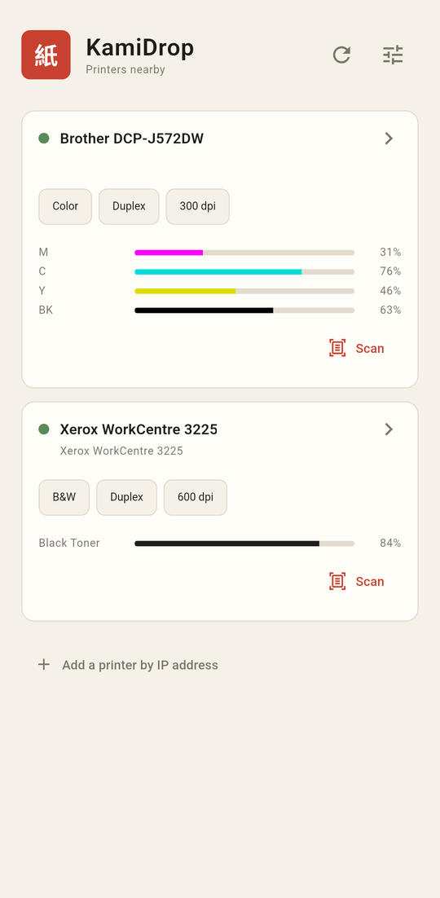
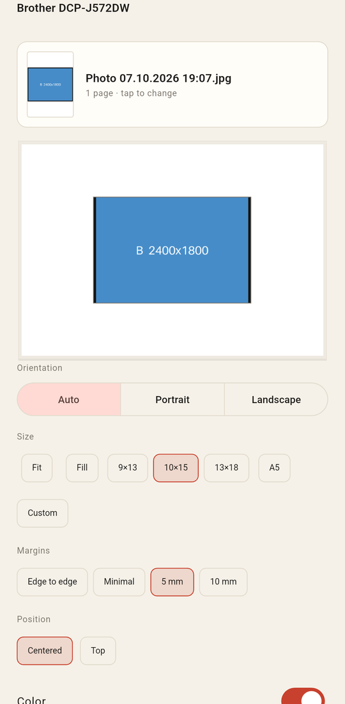
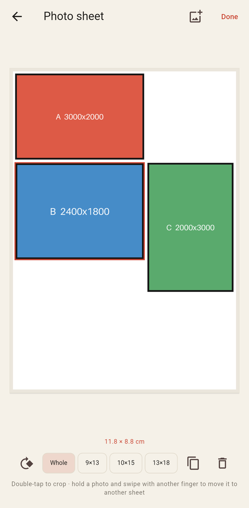
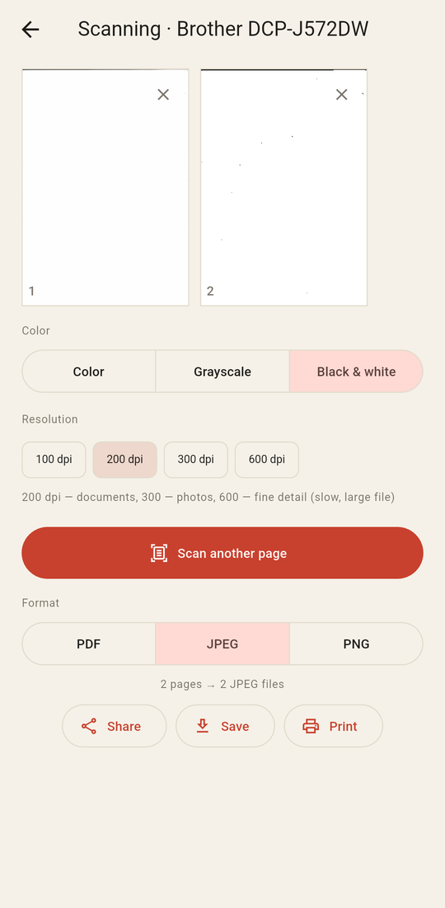
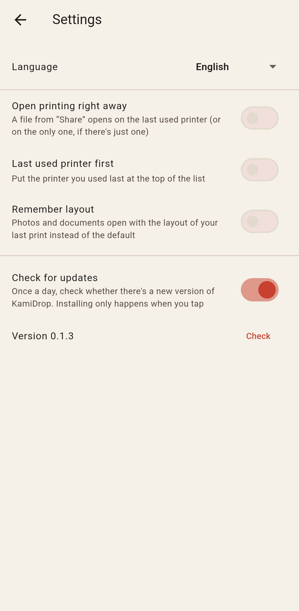

# KamiDrop 紙

**English** · [Українська](README.uk.md)

Lightweight local printing and scanning for Android — "like AirPrint": no drivers, no accounts, no cloud.
KamiDrop finds printers on your Wi-Fi by itself, prints over IPP in the AirPrint raster format and scans
over eSCL (AirScan).

<p align="center">
  
  
  
  
  
</p>

## Features

- **Finds printers and scanners automatically** (mDNS / DNS-SD) and remembers them; a printer can also be
  added by IP. Shows the printer state, color / duplex / resolution and ink or toner levels.
- **Prints PDFs and photos**: preview with a page strip, page ranges ("3-5, 8"), color, two-sided printing,
  copies, cancelling a running job.
- **Layout editor**: orientation; fit / fill / 100 %; exact photo sizes 9×13, 10×15, 13×18, A5 with cropping;
  margins, or edge-to-edge printing on printers that support it. What you see is exactly what gets printed —
  sizes on paper were checked with a ruler and a scanner (1:1, 10.0 mm grid).
- **Several photos on a sheet**: drag, pinch to resize, rotate, exact sizes with cropping, double-tap to
  adjust the crop, hold a photo and swipe with another finger to move it to another sheet.
- **Scanning** from the glass or the document feeder: color, grayscale or black & white, 75–600 dpi;
  save as **PDF** (one file), **JPEG** or **PNG**, share, or print right away (a copier).
- **"Share → KamiDrop"** from the gallery, files or any app.
- **Updates itself** from GitHub releases (checked once a day; installs only when you tap).
- **English and Ukrainian** — picked from the system language or chosen in Settings.

You need a printer with AirPrint support (most network printers made after ~2013) and an Android 7+
phone on the same Wi-Fi network. Scanning needs a scanner with eSCL / AirScan (or a gateway such as
[AirSane](https://github.com/SimulPiscator/AirSane) for scanners without it).

## Install

1. Download the APK from the [latest release](https://github.com/4bit33/kamidrop/releases/latest):
   `kamidrop-…-arm64-v8a.apk` fits almost all modern phones.
2. Open it on the phone and allow installing from this source.
3. Google Play Protect may warn that the developer isn't verified — that's normal for apps installed
   outside Google Play. Tap **"Install anyway"**.

After that KamiDrop tells you when a new version is out.

## How it works

Almost everything is implemented in plain Dart, without printing or scanning libraries:

| Part | What it does |
|---|---|
| `lib/ipp/` | A minimal **IPP** client (RFC 8010/8011): request encoding incl. collections (`media-col`), response parsing, Print-Job, Get-Job-Attributes, Cancel-Job |
| `lib/printing/urf.dart` | **URF (Apple raster)** encoder/decoder with PackBits, back-side flipping for duplex |
| `lib/printing/compose.dart` | Page layout in millimetres, printer margins from IPP, rotation, cropping, sRGB / gray |
| `lib/printing/collage.dart` | Photo sheets: frames in mm, auto-arrangement, cropping (zoom/pan), composition in an isolate |
| `lib/scan/escl.dart` | **eSCL** scanning client: capabilities, multi-page jobs from the feeder |
| `lib/scan/pdf_writer.dart` | A tiny **PDF writer**: scanner JPEGs without re-encoding, 1-bit pages for black & white |
| `lib/discovery/` | Printer and scanner discovery: Android `NsdManager`, mDNS elsewhere; memory of printers |
| `lib/update/` | Self-update from GitHub releases via Android `PackageInstaller` |

Things learned the hard way are worth a look if you write your own client: for example, a Brother
DCP-J572DW silently ignores eSCL scan settings if the XML contains line breaks, and hangs on a chunked
request body.

## Building

You need [Flutter](https://flutter.dev) (stable) and the Android SDK.

```
flutter pub get
flutter test
flutter run                                   # on a connected phone
flutter build apk --release --split-per-abi   # release APKs
```

Release builds are signed with the key from `android/key.properties` (not in the repository, see
[Flutter docs](https://docs.flutter.dev/deployment/android#signing-the-app)); without it the debug key
is used. There is also a Linux build for quick development: `flutter run -d linux`.

Translations live in `lib/l10n/app_uk.arb` (source) and `lib/l10n/app_en.arb`.

## Roadmap

- **Desktop app** (Linux, Windows) — the core is plain Dart and already runs on Linux.
- **Smarter "Share → print"**: pick the right printer and settings for the shared file automatically.
- **One-tap copy**: scan and print in one step.
- **IPP Everywhere / PWG raster** for printers without AirPrint raster.
- **Direct JPEG printing** on printers that accept it (smaller jobs, better photo quality).
- Photo prints for documents (3×4, 3.5×4.5 with cut lines).

## License

[MIT](LICENSE)
